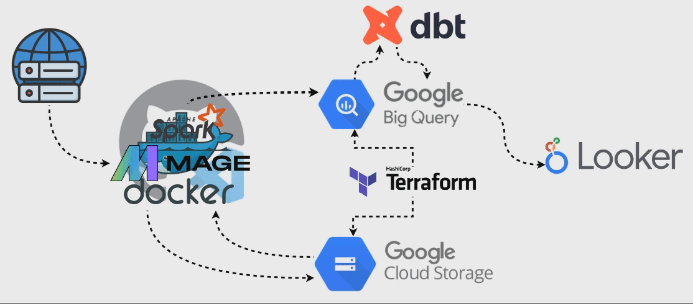

# Olympic Data Pipeline
Quick Links: [Looker Studio Data Visualization](https://lookerstudio.google.com/reporting/ad0360d8-04d4-4dec-9184-897b87895043/page/LS0uD) | [Reproduction Guide](grading_and_reproduction/REPRODUCTION_GUIDE.md) | [Grading Guide](grading_and_reproduction/GRADING_GUIDE.md)

Analyzing historical Olympic data (1896-2016) with a data pipeline
-
This document describes a data pipeline that leverages Terraform for infrastructure setup, Docker for containerized data processing with Mage and Apache Spark, Google BigQuery for data analysis and storage, and dbt (data build tool) for advanced data transformation and modeling. The pipeline integrates these technologies to streamline the process from data ingestion to visualization, ensuring a robust and scalable architecture for handling and analyzing large datasets.

## Problem Statement

Navigating the expansive historical datasets of Olympic events poses significant challenges in data management, accessibility, and analysis. This project aims to harness a dataset encompassing extensive Olympic history to streamline data processing, enhance data quality, and facilitate advanced analytical capabilities.

## Objective

The objective of this project is twofold:

- **Clean and Transform Data:** Utilize Apache Spark within a Docker container to perform data cleaning and transformation tasks, ensuring a clean and consistent dataset.
- **Enrich and Analyze Data:** Enhance the dataset with additional dimensions and metrics, employing dbt for data modeling and transformation, and ultimately visualizing the enriched data in a user-friendly Looker dashboard.

# Pipeline Structure

## Terraform (Setup Infrastructure)

- **Data Input:** Configuration files defining required cloud resources.
- **Action:** Provisions cloud infrastructure, including Google Cloud Storage (GCS) buckets for raw data storage and BigQuery datasets and tables for processed data storage, ensuring a ready environment for data processing and analysis.
- **Data Output to:** Infrastructure prepared for raw data storage in GCS, processing with Apache Spark within a Docker container, and analysis in BigQuery.

## Data Ingestion (Initial Data Loading into GCS)

- **Data Input:** Raw Olympic data collected from various internet sources.
- **Action:** Utilizes a Docker container with Mage to automate the initial data ingestion process, directly loading raw data into Google Cloud Storage (GCS) without immediate processing. This step prepares the data for subsequent processing and ensures it is securely stored in a scalable cloud environment.
- **Data Output to:** Raw data securely stored in Google Cloud Storage, ready for detailed processing and transformation.

## Docker Container (Data Processing with Mage and Apache Spark)

- **Data Input:** Raw data from Google Cloud Storage (GCS), previously ingested from internet sources.
- **Action:** Hosts a separate Docker container equipped with Mage and Apache Spark to perform comprehensive data processing. This phase includes cleaning the raw data, transforming it into a structured format, and performing necessary aggregations and data enrichment tasks to prepare it for analytical queries and visualization.
- **Data Output to:** Processed and structured data, optimized for analysis, is loaded into Google BigQuery for subsequent storage, further transformations, and analysis.
ata Output to:** Processed data ready for loading into BigQuery for subsequent storage and analysis.

## Google BigQuery (Data Analysis and Storage)

- **Data Input:** Processed and transformed data from Apache Spark, orchestrated by Mage for direct loading.
- **Action:** Stores and enables complex querying of processed data. Optimizes query performance and cost by partitioning and clustering tables based on expected query patterns.
- **Data Output to:** Data structured and optimized for further transformations with dbt and analysis.

## dbt (Data Transformation within BigQuery)

- **Data Input:** Data loaded into BigQuery from previous steps.
- **Action:** Performs SQL-based transformations and modeling within BigQuery to refine data for analysis, utilizing partitioned and clustered tables for efficient data manipulation.
- **Data Output to:** Refined and modeled data within BigQuery, ready for visualization.

## Google Data Studio (Visualization)

- **Data Input:** The transformed and modeled data within BigQuery.
- **Action:** Creates interactive dashboards and reports for data visualization and insights, benefiting from the optimized data structure.
- **Data Output:** Engaging visualizations that provide actionable insights to stakeholders.

This pipeline facilitates a streamlined workflow from data ingestion to visualization, leveraging the integration of Mage and Apache Spark within a Docker container to simplify the processing steps and enhance the efficiency of the overall pipeline.

